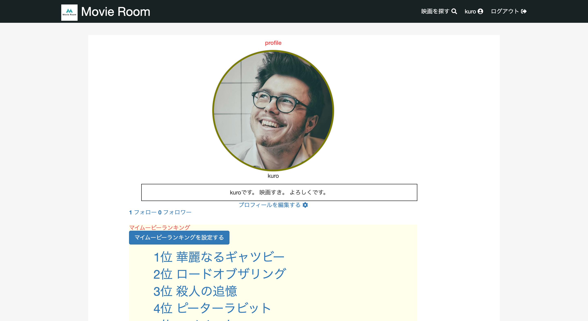

# アプリ名
Movie Room  

# 概要
映画好きの人同士が繋がるコミュニティサイトです。
* 映画検索
* 友達申請
* 友人とのチャット
* 映画のレビュー投稿
* マイムービーランキング

# 本番環境
デプロイ先(heroku)  
https://movie-room-app.herokuapp.com/

テストアカウント＆ID  
ID：movie@sample.com  
Pass：testtest1!

バケット名  
movieroom-bucket

# 制作背景(意図)
趣味が映画なのでそれに関わるアプリを制作したいと思い制作しました。

制作するにあたり取り組みたいと思ったの技能は下記の点です。  
* APIを使用する
* JavaScriptを使用する
* チャット機能
* 多対多の関係を持ったテーブル構成

# DEMO
* ログイン画面

* トップ画面

* マイページ

* 映画検索

# 工夫したポイント
映画APIの取得方法
JavaScriptを使用した映画ランキングの設定方法

# 使用技術(開発環境)
Ruby on Rails  
JQuery  
MySQL  
Bootstrap  

# 課題や今後実装したい機能
映画ランキング登録のJavaScrip修正
フォロー機能のAjax化
お気に入り機能

# 今後、習得したい技術
Docker技術を使用した開発（2020/05/26時点でdocker学習中）  
Laravel

# DB設計

## usersテーブル

|Column|Type|Options|
|------|----|-------|
|name|text|null: false|
|email|text|null: false|
|encrypted_password|text|null: false|
|reset_password_token|text| |
|reset_password_sent_at|datetime| |
|remember_created_at|profile_img| |
|introduction|text|null: false|
|profile_img|text|null: false|

### Association
- has_many :messages
- has_many :groups, through: :groups_users
- has_many :groups_users

## groupsテーブル

|Column|Type|Options|
|------|----|-------|
|name|text|null: false|

### Association
- has_many :messages
- has_many :users, through: :groups_users
- has_many :groups_users

## messagesテーブル

|Column|Type|Options|
|------|----|-------|
|content|text| |
|image|text| |
|group_id|integer|null: false, foreign_key: true|
|user_id|integer|null: false, foreign_key: true|

### Association
- belongs_to :group
- belongs_to :user

## groups_usersテーブル

|Column|Type|Options|
|------|----|-------|
|group_id|integer|null: false, foreign_key: true|
|user_id|integer|null: false, foreign_key: true|

### Association
- belongs_to :group
- belongs_to :user

## my_rankingsテーブル
|Column|Type|Options|
|------|----|-------|
|title|text|null: false|
|content|text|null: false|
|row_order|integer|null: false|
|user_id|integer|null: false|

### Association
- belongs_to :user

## postsテーブル
|Column|Type|Options|
|------|----|-------|
|title|text|null: false|
|content|text|null: false|
|user_id|integer|null: false|
|poster_path|text|null: false|
|movie_id|varchar|null: false|
|rate|float|null: false|

### Association
- belongs_to :user

## relationshipsテーブル
|Column|Type|Options|
|------|----|-------|
|follower_id|integer|null: false|
|following_id|integer|null: false|

### Association
- belongs_to :user
